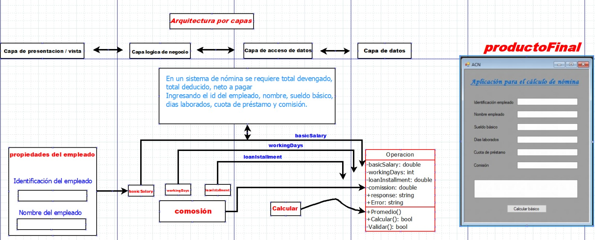

# Calculadora Neto a Pagar

## _Aplicación presentada como evidencia de exámen .Net Framework._

El entorno de de desarrollo para este proyecto: _.Net 4.7._

## Inicio

Es necesario compilar la solución contenida en el directorio _LibPayrollSystem_. Luego, desde la solución que está en el directorio _PayrollSystemUI_ que contiene la GUI de la aplicación. Desde allí, y sin correr la solución, se importa la librería construida mediante la compilación que se hizo con anterioridad.

Para Linux: _abrir una terminal en el directorio del proyecto y ejecutar:_
__________________________
__________________________

## Autor

* **Andrés E. Restrepo F.**
* **Juan M Florez.**

- *This project* :  [Calculadora Neto a Pagar](https://github.com/andres613/neto-a-pagar-dotnet)
